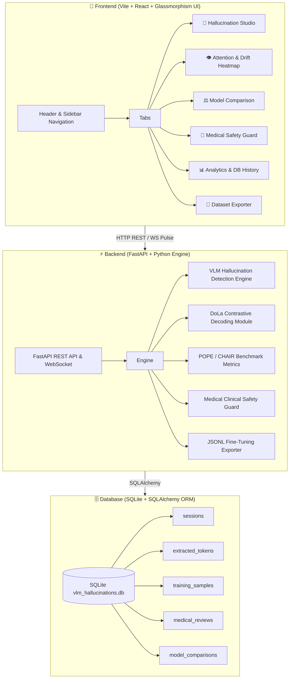

# 🧠 Enterprise VLM Hallucination Engine & Fine-Tuning Suite

> **Production-Grade, Full-Stack Vision-Language Model (VLM) Hallucination Extraction, Analytics, DoLa Decoding & Synthetic Dataset Platform**


---

## 📌 Executive Summary

Vision-Language Models (VLMs) like Google Gemma-4 VLM, PaliGemma-3B, LLaVA-1.6, and Qwen-VL frequently generate **unsupported, spurious visual details (hallucinations)** when processing complex images or ambiguous text prompts.

The **Enterprise VLM Hallucination Engine** is a full-stack, real-time analytics and fine-tuning suite designed to:
1. **Detect & Extract** token-level logit entropy ($H$) and visual grounding alignment vectors ($G$) in real time.
2. **Mitigate Hallucinations** dynamically using **DoLa Contrastive Decoding** ($\text{Logits}_{\text{DoLa}} = \text{Logits}_L - \alpha \cdot \text{Logits}_M$).
3. **Benchmark Multi-VLM Architectures** using standard academic metrics (**POPE Accuracy**, **CHAIR$_s$**, **CHAIR$_i$**).
4. **Enforce Medical Clinical Guardrails** for radiology imaging (Chest X-Ray, Brain MRI, CT scans) to flag ungrounded clinical pathologies.
5. **Export Fine-Tuning Datasets** in **SFT**, **DPO Preference Pairs** (`chosen` vs `rejected`), and **Alpaca** JSONL formats.

---

## 🏛️ System Architecture



---

## 🔬 Mathematical Formulations & Innovations

### 1. Token Logit Entropy ($H$)
Measures the uncertainty in the VLM's next-token probability distribution over vocabulary $V$:
$$H(t) = -\sum_{w \in V} P(w \mid x, I) \log P(w \mid x, I)$$
Tokens with $H(t) \ge \text{threshold}$ (default $0.65$) indicate high model uncertainty and potential hallucination drift.

### 2. Visual Semantic Drift Index ($V_{\text{drift}}$)
Combines visual grounding alignment score $G(t) \in [0, 1]$ with Shannon Entropy:
$$V_{\text{drift}} = \min\left(1.0, \max\left(0.0, 1.0 - \bar{G} + 0.3 \cdot \bar{H}\right)\right)$$

### 3. DoLa Contrastive Decoding
Subtracts high-entropy premature mature layer activations $M$ from final layer activations $L$:
$$\text{Logits}_{\text{DoLa}} = \text{Logits}_L - \alpha \cdot \text{Logits}_M \quad (\alpha \in [0.0, 1.0])$$

### 4. CHAIR Metrics (Caption Hallucination Assessment in Image Recall)
- **CHAIR$_s$ (Sentence-level)**: Fraction of generated sentences containing at least one hallucinated object.
- **CHAIR$_i$ (Instance-level)**: Ratio of hallucinated object instances to all mentioned object instances.

---

## 🌟 Workspace Modules & Features

| Module | Icon | Key Features |
| :--- | :---: | :--- |
| **Hallucination Studio** | 🔬 | Real-time prompt & image submission, token entropy chip inspector, visual drift sliders, and response preview. |
| **Attention Heatmap** | 👁️ | 2D spatial feature grid canvas rendering uploaded images directly with radial heatmap hotspots & attention pins. |
| **Model Comparison** | ⚖️ | Side-by-side benchmark across **Gemma-4 VLM**, **PaliGemma-3B**, **LLaVA-1.6**, & **Qwen-VL** with DoLa $\alpha$ tuning slider. |
| **Medical Safety Guard** | 🏥 | Clinical radiology inspector checking anatomical grounding, ungrounded pathology flags, and clinical risk badges. |
| **Analytics & DB History** | 📊 | SQLite session log table with instant search/filter bar, record detail inspect modal, deletion & database clear. |
| **Dataset Exporter** | 💾 | Fine-tuning dataset generator exporting in **SFT**, **DPO Preference Pairs**, and **Alpaca** JSONL formats. |

---

## ⚡ Quickstart & Installation Guide

### Prerequisites
- **Python**: 3.10 or higher
- **Node.js**: v18 or higher (with `npm`)

### 1. Clone & Setup Repository
```bash
git clone https://github.com/amanvarma/vlm-hallucination-engine.git
cd vlm-hallucination-engine
```

### 2. Install Backend Dependencies
```bash
cd backend
pip install -r requirements.txt
```

### 3. Install Frontend Dependencies
```bash
cd ../frontend
npm install
```

### 4. Launch Unified Application
From the root directory:
```bash
python run_app.py
```
> The unified server automatically starts the FastAPI backend on `http://127.0.0.1:8000` and Vite dev server on `http://localhost:3000`.

---

## 📡 REST API Reference

| Endpoint | Method | Description |
| :--- | :---: | :--- |
| `/api/health` | `GET` | Health check & system status. |
| `/api/stats` | `GET` | Overall dashboard metrics & active models. |
| `/api/analyze` | `POST` | Executes token entropy analysis & visual drift extraction. |
| `/api/compare` | `POST` | Multi-model benchmark with DoLa contrastive decoding. |
| `/api/medical-guard` | `POST` | Clinical radiology anatomical grounding & hallucination check. |
| `/api/medical-reviews` | `GET` | Historical clinical safety audit records. |
| `/api/sessions` | `GET` | Fetch session history logs. |
| `/api/sessions/{id}` | `DELETE` | Delete specific session record. |
| `/api/clear-sessions` | `DELETE` | Clear all database records. |
| `/api/training-samples` | `GET` | Fetch extracted hallucination dataset pairs. |
| `/api/export-dataset` | `POST` | Download JSONL dataset file. |

---

## 👨‍💻 Author & Contact Information

**Lead Architect & Developer**: **Aman Varma**  
*AI & Multimodal Vision-Language Model Systems Specialist*

- **GitHub**: [github.com/amanvarma223](https://github.com/amanvarma)
- **LinkedIn**: [linkedin.com/in/amanvarma](https://linkedin.com/in/amanvarma)
- **Email**: `amanvarma.ai@gmail.com`
- **Location**: India / Global Remote

---

## 📜 License

This project is licensed under the **MIT License** — see the [LICENSE](LICENSE) file for details.

*Built with ❤️ for Vision-Language Model Reliability & Safety.*
